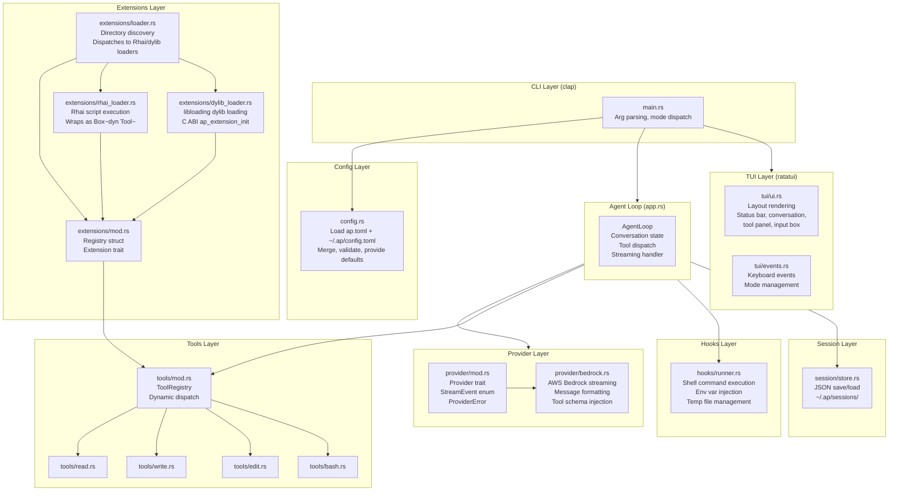
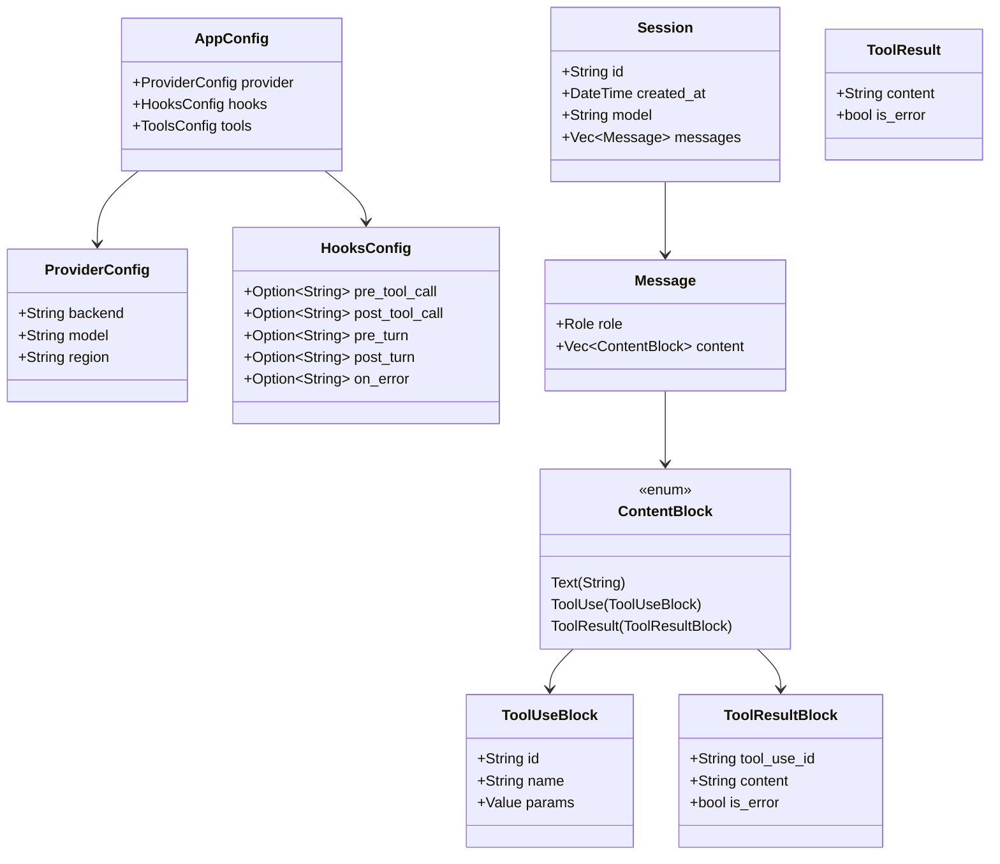

# Design — ap AI Coding Agent

*Synthesized from rough-idea.md + idea-honing.md Q&A sessions. 2026-03-22.*

---

## 1. Overview

**Problem:** Terminal-based AI coding agents (like `pi`) exist but are implemented in scripting languages. There is demand for a native, fast, extensible agent that feels like a proper CLI tool.

**Solution:** `ap` is a terminal AI coding agent written in Rust. It uses ratatui for TUI rendering, AWS Bedrock (Claude) for LLM calls, and provides a clean, extensible architecture via a `Tool` trait and `Extension` trait. It runs in both interactive TUI mode and headless `-p` mode suitable for scripting.

**Key design principles:**
- **Correctness over concurrency:** Sequential tool execution in v1 prevents ordering bugs
- **Safety by default:** Hooks are opt-in; pre_tool_call is the only hard gate; all other hooks are advisory
- **Clean interfaces:** Traits for tools and extensions are the surface area; internals are replaceable
- **Fast path:** Non-interactive mode (`-p`) is a first-class citizen, not an afterthought
- **First-class extensions:** Both Rhai scripting and Rust dylib extensions ship in v1 — neither is a stub

---

## 2. Detailed Requirements

See `requirements.md` for full numbered requirements (R1–R12).

Key decisions baked into the design:
- **Sequential tool execution** (R4.1): prevents ordering bugs between tool calls
- **pre_tool_call is the only hard gate** (R5.2): non-zero exit cancels; all others advisory
- **post_tool_call is a transform hook** (R5.3): stdout replaces result content
- **pre_turn/post_turn are read-only observers** (R5.4): large payloads via temp files
- **Extensions are first-class in v1** (R6.4): both Rhai scripts and Rust dylibs are fully supported

---

## 3. Architecture Overview



---

## 4. Components and Interfaces

### 4.1 `main.rs` — Entry Point

Responsibilities:
- Parse CLI args with clap (`-p`, `--session`, `--version`)
- Load config (merge global + project)
- Discover and register extensions
- Dispatch to: TUI mode or non-interactive mode

### 4.2 `config.rs` — Configuration

Responsibilities:
- Load `ap.toml` (project-level, optional) and `~/.ap/config.toml` (global, optional)
- Merge project over global (project wins on conflicts)
- Provide typed `AppConfig` struct with all defaults

Key config structure:
```toml
[provider]
backend = "bedrock"
model = "us.anthropic.claude-sonnet-4-6"
region = "us-west-2"

[tools]
# parallel = false  # v2 only, documented not implemented

[hooks]
pre_tool_call = "~/.ap/hooks/pre_tool.sh"
post_tool_call = "~/.ap/hooks/post_tool.sh"
pre_turn = "~/.ap/hooks/pre_turn.sh"
post_turn = "~/.ap/hooks/post_turn.sh"
on_error = "~/.ap/hooks/on_error.sh"

[extensions]
# auto-discovered from ~/.ap/extensions/ and ./.ap/extensions/
```

### 4.3 `tools/` — Tool Trait and Built-ins

**`Tool` trait:**

> **Object-safety note (FAIL-2 fix):** `impl Future` in traits is not object-safe and cannot be used with `Box<dyn Tool>`. The trait must use `BoxFuture` from the `futures` crate (or re-exported from `tokio`). This gives a concrete, object-safe return type while keeping the async ergonomics at call sites.

```rust
use futures::future::BoxFuture;

pub trait Tool: Send + Sync {
    fn name(&self) -> &str;
    fn description(&self) -> &str;
    fn schema(&self) -> serde_json::Value;  // JSON Schema for parameters
    fn execute(&self, params: serde_json::Value) -> BoxFuture<'_, ToolResult>;
}

pub struct ToolResult {
    pub content: String,
    pub is_error: bool,
}
```

Implementors use `Box::pin(async move { ... })` or the `futures::future::FutureExt::boxed()` combinator. The `async_trait` crate is an acceptable alternative if the team prefers it (generates equivalent `BoxFuture` machinery), but `BoxFuture` is explicit and avoids a macro dependency.

**`ToolRegistry`:**
- Holds `Vec<Box<dyn Tool>>`
- `find_by_name(name: &str) -> Option<&dyn Tool>`
- `all_schemas() -> Vec<serde_json::Value>` — used to inject tool definitions into Bedrock API calls

**Built-in tools:**
- `ReadTool`: reads file path, returns content string
- `WriteTool`: writes content to path (creates parent dirs)
- `EditTool`: finds `old_text` in file, replaces with `new_text`; errors if not found; **returns error with count if `old_text` matches more than once** (e.g. `"old_text matches 3 occurrences (must be unique)"`) — forces LLM to provide more specific context (C1 fix)
- `BashTool`: runs command via `tokio::process::Command`, returns `stdout\nstderr\nexit: N`; **no timeout in v1** — commands can run indefinitely (C2 fix: safe default, documented for v2)

### 4.4 `provider/` — Provider Trait and AWS Bedrock Implementation

#### `provider/mod.rs` — Provider Trait (FAIL-1 fix)

The `Provider` trait abstracts the LLM backend. This makes the agent loop testable with a mock provider and keeps the Bedrock implementation replaceable.

```rust
use futures::stream::BoxStream;

/// A streaming LLM provider.
pub trait Provider: Send + Sync {
    /// Stream a completion. Returns a stream of `StreamEvent`s.
    fn stream_completion<'a>(
        &'a self,
        messages: &'a [Message],
        tools: &'a [serde_json::Value],
    ) -> BoxStream<'a, Result<StreamEvent, ProviderError>>;
}

#[derive(Debug, thiserror::Error)]
pub enum ProviderError {
    #[error("credential/auth error: {0}")]
    Auth(String),
    #[error("API error (status {status}): {message}")]
    Api { status: u16, message: String },
    #[error("stream decode error: {0}")]
    Decode(String),
    #[error("transport error: {0}")]
    Transport(#[from] anyhow::Error),
}

pub enum StreamEvent {
    TextDelta(String),
    ToolUseStart { id: String, name: String },
    ToolUseParams(serde_json::Value),
    ToolUseEnd,
    TurnEnd { stop_reason: String, input_tokens: u32, output_tokens: u32 },
}
```

`AgentLoop` in `app.rs` holds `Arc<dyn Provider>`, injected at construction time. Tests inject a `MockProvider`.

#### `provider/bedrock.rs` — AWS Bedrock Provider

#### `provider/bedrock.rs` — AWS Bedrock Provider

Responsibilities:
- Build `aws_sdk_bedrockruntime` client from config
- Format conversation history into Bedrock's `messages` array
- Inject tool schemas into `tool_config` for each API call
- Stream response via `invoke_model_with_response_stream`
- Parse streaming chunks: text deltas, tool_use blocks, stop reason
- Implement `Provider` trait (returns `BoxStream<StreamEvent>`)

`BedrockProvider` implements `Provider`. `StreamEvent` is defined in `provider/mod.rs` (shared across providers).

### 4.5 `hooks/runner.rs` — Hook Runner

Responsibilities:
- Execute a hook shell command as a subprocess
- Inject env vars per hook type (see R5.2–R5.4)
- Capture stdout, stderr, exit code
- Apply hook protocol (gate / transform / observe)
- Manage temp files for pre_turn/post_turn/on_error (create before, delete after)

**Key types:**
```rust
pub enum HookOutcome {
    Proceed,
    Cancelled { reason: String },  // pre_tool_call only
    Transformed { content: String }, // post_tool_call only
    Observed,                       // pre_turn, post_turn, on_error
    HookWarning { message: String }, // non-zero on advisory hooks
}
```

**run_pre_tool_call(hook_cmd, tool_name, params) -> HookOutcome**
**run_post_tool_call(hook_cmd, tool_name, params, result) -> HookOutcome**
**run_observer_hook(hook_cmd, hook_type, data_file_contents) -> HookOutcome**

### 4.6 `app.rs` — Agent Loop

Responsibilities:
- Hold conversation history (`Vec<Message>`)
- Hold `Arc<dyn Provider>` (injected at construction, allows mock in tests)
- Coordinate one agent turn:
  1. Fire `pre_turn` hook (observer)
  2. Stream completion from Bedrock
  3. Fire `post_turn` hook (observer)
  4. If stop_reason = `tool_use`: execute tools sequentially with hooks
  5. Append tool results to history as user turn
  6. Loop until stop_reason = `end_turn`
- Emit events for TUI updates (via `mpsc` channel)
- Handle streaming output for `-p` mode (write to stdout)

**Agent turn data flow:**
```mermaid
sequenceDiagram
    participant Loop as AgentLoop
    participant Hooks as HookRunner
    participant LLM as BedrockProvider
    participant Tools as ToolRegistry

    Loop->>Hooks: pre_turn (observer)
    Loop->>LLM: stream_completion(messages, tool_schemas)
    LLM-->>Loop: StreamEvent(TextDelta/ToolUse/...)
    Loop->>Hooks: post_turn (observer)
    alt stop_reason = tool_use
        loop for each tool_use (sequential — R4.1)
            Loop->>Hooks: pre_tool_call
            alt exit 0 → not cancelled
                Loop->>Tools: execute(name, params)
                Tools-->>Loop: ToolResult
                Loop->>Hooks: post_tool_call (transform)
            else exit N → cancelled (R4.3: remaining tools still run)
                Loop->>Loop: synthetic error result (is_error: true, reason from stdout)
            end
        end
        Note over Loop: All results (including cancellations) batched into single user turn (R4.4)
        Loop->>Loop: append to history, loop
    end
```

### 4.7 `tui/` — Ratatui TUI

**Layout (tui/ui.rs):**
```
┌─────────────────────────────────────┐
│  Status: claude-sonnet-4-6 | 1234t  │  ← status bar
├────────────────────┬────────────────┤
│                    │  [Tool Panel]  │
│  Conversation      │  bash: ls -la  │
│  (scrollable)      │  ✓ read: main  │
│                    │  ⟳ write:...   │
├────────────────────┴────────────────┤
│> _                                  │  ← input box
└─────────────────────────────────────┘
```

**Mode state machine (tui/events.rs):**
```
Normal ──i/Enter──> Insert ──Esc──> Normal
Normal ──Ctrl+C──> Quit
Normal ──/help──> HelpModal ──Esc──> Normal
```

**TUI ↔ Agent communication:** `tokio::sync::mpsc` channel; agent sends `UiEvent` variants (TextChunk, ToolStart, ToolEnd, TurnEnd, Error) that the TUI event loop renders.

### 4.8 `extensions/` — Extension System (v1: Rhai + Dylib)

**Design amendment (2026-03-22):** Both Rhai scripting and Rust dylib extensions are first-class in v1. Neither is a stub. Discovery scans `~/.ap/extensions/` and `./.ap/extensions/` for `.rhai` files and `.dylib`/`.so` files.

#### `extensions/mod.rs` — Core Traits

> **FAIL-3 fix:** R6.3 requires `Registry` to support tools, hooks, TUI panels, and message interception. All four surfaces are defined in v1. Tool registration has a live implementation. Hook, panel, and intercept registrations are accepted and collected (no-op'd at runtime in v1 — execution wired in v2).

```rust
pub trait Extension: Send + Sync {
    fn name(&self) -> &str;
    fn version(&self) -> &str;
    fn register(&self, registry: &mut Registry);
}

/// v1: tools vec is live; hooks/panels/interceptors are interface stubs (accepted, not executed).
pub struct Registry {
    pub tools: Vec<Box<dyn Tool>>,
    pub hooks: Vec<HookRegistration>,                         // v1: collected, not invoked
    pub panels: Vec<Box<dyn Panel>>,                          // v1: collected, not rendered
    pub message_interceptors: Vec<Box<dyn MessageInterceptor>>, // v1: collected, not invoked
}

/// Stub traits — defined so the API is correct; no-op in v1.
pub trait Panel: Send + Sync {
    fn name(&self) -> &str;
    // Rendering methods added in v2
}

pub trait MessageInterceptor: Send + Sync {
    fn name(&self) -> &str;
    // Transform methods added in v2
}

pub struct HookRegistration {
    pub lifecycle: HookLifecycle,  // PreToolCall | PostToolCall | PreTurn | PostTurn | OnError
    pub command: String,           // Shell command to run
}
```

#### Rhai Script Extensions (`extensions/rhai_loader.rs`)

Rhai is a Rust-native embedded scripting language (`rhai` crate). Extensions written in Rhai are `.rhai` files in the extension directories. They are sandboxed, statically typed, and require no external runtime.

**Rhai script interface:** A valid Rhai extension must define these four functions:

```rhai
// Example: my_tool.rhai
fn name() { "my_tool" }
fn description() { "Does something useful" }
fn schema() {
    #{
        type: "object",
        properties: #{
            input: #{ type: "string", description: "Input value" }
        },
        required: ["input"]
    }
}
fn execute(params) {
    let input = params["input"];
    // do work...
    #{ content: `Result: ${input}`, is_error: false }
}
```

**Rust wrapping:** `rhai_loader.rs` wraps each Rhai script in a `RhaiTool` struct that:
1. Loads and compiles the script into a `rhai::Engine` at startup
2. Implements `Tool` trait via `Box<dyn Tool>`, calling the Rhai `execute(params)` function
3. Converts `params: serde_json::Value` → `rhai::Map` → back to `ToolResult`
4. If the script throws a Rhai error, returns `ToolResult { is_error: true, content: err_msg }`

```rust
struct RhaiTool {
    engine: rhai::Engine,
    ast: rhai::AST,
    name: String,
    description: String,
    schema: serde_json::Value,
}

impl Tool for RhaiTool {
    fn name(&self) -> &str { &self.name }
    fn description(&self) -> &str { &self.description }
    fn schema(&self) -> serde_json::Value { self.schema.clone() }
    fn execute(&self, params: serde_json::Value) -> BoxFuture<'_, ToolResult> {
        // Rhai is sync; wrap in Box::pin(async move { ... })
        // Convert params to rhai::Map, call execute(), convert result back
        Box::pin(async move { /* ... */ })
    }
}
```

**Crate:** `rhai = { version = "1", features = ["sync"] }` in `Cargo.toml`.

> **FAIL-NEW-1 fix:** `rhai::Engine` is `!Send + !Sync` by default. Since `RhaiTool` holds an `Engine` and must implement `Tool: Send + Sync`, the `sync` feature flag is mandatory. Without it, the code will not compile. The `sync` feature makes `Engine: Send + Sync`.

#### Rust Dylib Extensions (`extensions/dylib_loader.rs`)

Rust dylib extensions are compiled Rust libraries (`.dylib` on macOS, `.so` on Linux) that export a C ABI entry point. They are loaded at startup via the `libloading` crate.

**C ABI entry point (extension authors implement this):**

```rust
// In the extension crate (e.g., my_extension/lib.rs):
#[no_mangle]
pub extern "C" fn ap_extension_init(registry: *mut ap::extensions::Registry) {
    let registry = unsafe { &mut *registry };
    registry.tools.push(Box::new(MyTool));
}
```

**Loading (dylib_loader.rs):**

```rust
use libloading::{Library, Symbol};

type InitFn = unsafe extern "C" fn(*mut Registry);

/// Load a dylib and call its ap_extension_init entry point.
/// Returns the Library handle — caller MUST keep it alive for the process lifetime.
/// Dropping Library calls dlclose(), invalidating all registered vtables.
pub fn load_dylib(path: &Path, registry: &mut Registry) -> anyhow::Result<Library> {
    let lib = unsafe { Library::new(path)? };
    let init: Symbol<InitFn> = unsafe { lib.get(b"ap_extension_init")? };
    unsafe { init(registry as *mut Registry) };
    Ok(lib)  // transfer ownership to caller (ExtensionLoader.libraries)
}
```

**Safety notes:**
- `unsafe` is required for dylib loading; this is expected and documented
- The `Library` handle is kept alive for the process lifetime (stored in `ExtensionLoader.libraries`)
- **ABI safety (New C4 — strengthened warning):** Dylib extensions are inherently unsafe by design. Even with the same Rust compiler version, differing Cargo features, optimization levels, or struct layout changes between patch releases can cause undefined behavior. Extension authors must compile against the exact same `ap` crate version as the running binary. This is a power-user feature. The README must include a prominent warning: _"Dylib extensions are unsafe. Any toolchain or crate version mismatch will cause undefined behavior. Use Rhai extensions for safe, portable extension authoring."_
- If `ap_extension_init` symbol is not found, log a warning and skip the file

**Crate:** `libloading = "0.8"` in `Cargo.toml`.

#### `extensions/loader.rs` — Discovery and Dispatch

```rust
/// Owns loaded dylib handles for the process lifetime.
/// Dropping this struct would dlclose() the dylibs, invalidating all registered
/// function pointers and vtables — so it must outlive the Registry.
pub struct ExtensionLoader {
    libraries: Vec<Library>,  // FAIL-NEW-3 fix: keep Library handles alive
}

impl ExtensionLoader {
    pub fn new() -> Self { Self { libraries: Vec::new() } }

    pub fn discover_and_load(&mut self, registry: &mut Registry) -> Vec<LoadWarning> {
        let dirs = vec![
            home_dir().join(".ap/extensions"),
            PathBuf::from(".ap/extensions"),
        ];
        let mut warnings = Vec::new();
        for dir in dirs {
            if !dir.exists() { fs::create_dir_all(&dir).ok(); continue; }
            let entries = match fs::read_dir(&dir) {
                Ok(e) => e,
                Err(e) => { warnings.push(LoadWarning::DirRead(e.to_string())); continue; }
            };
            for entry in entries.flatten() {
                // FAIL-NEW-2 fix: Path::extension() returns Option<&OsStr>, not &str.
                // Use .and_then(|e| e.to_str()) to get Option<&str> for pattern matching.
                match entry.path().extension().and_then(|e| e.to_str()) {
                    Some("rhai") => load_rhai_script(&entry.path(), registry, &mut warnings),
                    Some("dylib") | Some("so") => {
                        match load_dylib(&entry.path(), registry) {
                            Ok(lib) => self.libraries.push(lib),  // keep alive!
                            Err(e) => warnings.push(LoadWarning::DylibLoad(e.to_string())),
                        }
                    }
                    _ => {}
                }
            }
        }
        warnings
    }
}
```

> **FAIL-NEW-3 fix:** `load_dylib` returns a `Library` handle. When `Library` is dropped, `libloading` calls `dlclose()`, unloading the shared library and making all registered vtables and function pointers dangling. `ExtensionLoader` stores all `Library` handles in `self.libraries: Vec<Library>`. The loader must be kept alive for the full process lifetime — typically stored on the application struct in `main.rs` alongside the `Registry`.

> **FAIL-NEW-2 fix:** `Path::extension()` returns `Option<&OsStr>`, not `&str`. Matching directly against string literals won't compile. The correct pattern is `.and_then(|e| e.to_str())` which yields `Option<&str>`, then match on `Some("rhai")`, `Some("dylib")`, etc.

### 4.9 `session/store.rs` — Session Persistence

**Session format (JSON):**
```json
{
  "id": "ses_abc123",
  "created_at": "2026-03-22T10:00:00Z",
  "model": "us.anthropic.claude-sonnet-4-6",
  "messages": [ ... ]
}
```

- `save(session: &Session) -> Result<()>` → `~/.ap/sessions/<id>.json`
- `load(id: &str) -> Result<Session>` → reads and deserializes
- Auto-generates session ID if not provided; creates `~/.ap/sessions/` if needed

---

## 5. Data Models



---

## 6. Error Handling

### Error Strategy

Use `anyhow::Error` for application errors throughout; define typed errors only at module boundaries where callers need to match on variants.

| Failure Mode | Strategy |
|---|---|
| Bedrock API error (transient) | Surface to user in TUI/stdout; do not retry automatically in v1 |
| Bedrock API error (auth/credential) | Fatal startup error with helpful message about credential chain |
| Tool execution error | Return `ToolResult { is_error: true, content: err_msg }`; Claude sees it and can decide |
| Hook subprocess crash | Log warning to TUI tool panel; apply advisory semantics (never block agent loop) |
| Hook script not found / not executable | Log warning to TUI tool panel; skip hook invocation, continue (C3 fix: missing hook is non-fatal) |
| Hook temp file I/O error | Log warning, skip hook invocation, continue |
| Config parse error | Fatal startup error with file path and parse message |
| Session load error | Non-fatal; warn and start fresh session |
| Extension directory missing | Non-fatal; warn and continue with no extensions |
| Rhai script syntax/compile error | Log warning with file path and error; skip that script |
| Rhai script missing required function (name/description/schema/execute) | Log warning; skip that script |
| Rhai execute() runtime error | Return `ToolResult { is_error: true }` with Rhai error message |
| Dylib `ap_extension_init` symbol not found | Log warning; skip that dylib |
| Dylib load error (wrong arch, missing deps) | Log warning with OS error; skip that dylib |
| `edit` tool: old_text not found | Return `ToolResult { is_error: true }` with descriptive message |

### `on_error` Hook

Fires when agent encounters an unrecoverable error (LLM error, tool panic). Observer only — receives error context via temp file. Does not alter agent behavior.

---

## 7. Testing Strategy

### Unit Tests (per module)

| Module | What to test |
|---|---|
| `tools/read` | File read success; file not found error |
| `tools/write` | Create file; create with nested dirs; overwrite |
| `tools/edit` | Replace text; old_text not found error |
| `tools/bash` | Command success; non-zero exit; stdout+stderr capture |
| `config` | Load defaults; merge global+project; missing file graceful |
| `hooks/runner` | pre_tool_call cancel (non-zero exit); post_tool_call transform (non-empty stdout); advisory hook (non-zero = warning only) |
| `session/store` | Save and reload session; missing dir created |
| `extensions/rhai_loader` | Load valid Rhai script, execute tool; script with syntax error returns warning; missing required fn returns warning |
| `extensions/dylib_loader` | Load dylib with valid symbol; missing symbol returns warning (tested with a mock dylib or by verifying error path logic) |

### Integration Tests

- Agent loop with mock Bedrock provider: full turn with tool_use → tool execution → result batching
- Hook integration: pre_tool_call hook cancels bash tool; synthetic error result in conversation
- `-p` mode: run headless with mock provider, verify stdout output

### Manual Acceptance Tests

- `ap -p "read Cargo.toml and summarize it"` with real Bedrock credentials
- TUI: start, type a message, verify tool panel shows tool activity
- `--session <id>` resume: verify history is preserved

---

## 8. Appendices

### A. Technology Choices

| Choice | Alternatives Considered | Reasoning |
|---|---|---|
| AWS Bedrock | OpenAI API, Anthropic direct | Project spec; enables Claude without needing separate API key; AWS credential chain is standard |
| ratatui | tui-rs (unmaintained), cursive | ratatui is the maintained successor to tui-rs; active ecosystem |
| tokio | async-std | tokio is the de-facto standard; AWS SDK for Rust requires tokio |
| anyhow | thiserror only | anyhow for application-level errors (ergonomic); thiserror for library boundary types (precise) |
| serde_json for hook data | MessagePack, protobuf | JSON is human-readable in hook scripts; hooks are shell scripts that use `jq` |
| Temp files for large hook payloads | Env vars | Linux env var limit ~128KB; conversation history easily exceeds this |
| Rhai for scripting extensions | Lua (mlua), JavaScript (deno_core), Python | Rhai is Rust-native, zero external runtime, statically typed, sandboxable by design; perfect for embedded scripting |
| libloading for dylib extensions | dlopen directly, abi_stable crate | libloading is the standard Rust crate for dynamic library loading; abi_stable adds overhead not needed in v1 |

### B. Hook Protocol Summary

```
pre_tool_call:
  input: AP_TOOL_NAME, AP_TOOL_PARAMS (env vars)
  exit 0  → proceed
  exit N  → cancel; stdout = cancellation reason to Claude (is_error tool_result)
  stderr  → TUI debug log only

post_tool_call:
  input: AP_TOOL_NAME, AP_TOOL_PARAMS, AP_TOOL_RESULT, AP_TOOL_IS_ERROR (env vars)
  exit 0 + non-empty stdout  → stdout replaces tool_result content
  exit 0 + empty stdout      → original result forwarded
  exit N                     → warning logged; original result forwarded
  stderr                     → TUI debug log only

pre_turn / post_turn / on_error:
  input: AP_HOOK_TYPE, AP_TURN_NUMBER, AP_SESSION_ID, AP_MODEL (env vars)
         AP_MESSAGES_FILE or AP_RESPONSE_FILE (path to temp JSON file)
  post_turn additionally:    AP_HAS_TOOL_USE ("true"/"false") (C5 fix: was missing from Appendix B)
  stdout  → ignored
  exit N  → advisory warning; agent continues
  stderr  → TUI debug log only
  temp files: created before hook, deleted after hook exits
```

### C. Project File Structure

```
ap/
├── Cargo.toml
├── ap.toml.example
├── README.md
└── src/
    ├── main.rs
    ├── app.rs           # AgentLoop, conversation state
    ├── config.rs        # AppConfig, load/merge
    ├── provider/
    │   ├── mod.rs       # Provider trait
    │   └── bedrock.rs   # AWS Bedrock streaming provider
    ├── tools/
    │   ├── mod.rs       # Tool trait, ToolRegistry, ToolResult
    │   ├── read.rs
    │   ├── write.rs
    │   ├── edit.rs
    │   └── bash.rs
    ├── hooks/
    │   ├── mod.rs       # HookConfig, HookOutcome
    │   └── runner.rs    # HookRunner
    ├── extensions/
    │   ├── mod.rs           # Extension trait, Registry, Panel, MessageInterceptor
    │   ├── loader.rs        # Directory discovery, dispatch to Rhai/dylib loaders
    │   ├── rhai_loader.rs   # Rhai script loading, RhaiTool wrapper
    │   └── dylib_loader.rs  # libloading dylib loading, C ABI ap_extension_init
    ├── tui/
    │   ├── mod.rs       # UiEvent, TuiApp
    │   ├── ui.rs        # ratatui layout and rendering
    │   └── events.rs    # Keyboard event handling, mode state
    └── session/
        ├── mod.rs       # Session struct
        └── store.rs     # Save/load JSON sessions
```

### D. Implementation Order (for Builder)

1. `Cargo.toml` + scaffold — all deps, `main.rs` prints version ✓
2. `config.rs` — toml loading, defaults, merge
3. `tools/` — trait + 4 built-ins + unit tests
4. `provider/bedrock.rs` — streaming API, message/tool formatting
5. `hooks/runner.rs` — shell exec, env injection, all three protocols
6. `extensions/` — trait definitions, Rhai script loader (rhai crate), Rust dylib loader (libloading crate)
7. `app.rs` — agent loop with tool dispatch, hook integration
8. `session/store.rs` — JSON save/load
9. `tui/` — layout, input, tool panel, event loop
10. `-p` non-interactive mode
11. `README.md`
12. Final polish: clippy, tests, zero warnings

### E. Key Constraints

- v1 extensions: **first-class** — Rhai scripts (`.rhai`) and Rust dylibs (`.dylib`/`.so`) both supported and loaded at startup
- v1 tool execution: sequential only (no parallel)
- v1 turn hooks: read-only observers only (no message modification)
- v1 streaming: ratatui must handle async Bedrock stream events without blocking the event loop (use tokio channels)
- Config files are optional — ap must start with no config files present
- Dylib ABI stability: extension authors must compile against the same `ap` crate version; ABI mismatch → warning + skip
- Rhai sandbox: engine configured with no file I/O or network access by default (extension scripts cannot escape sandbox)
