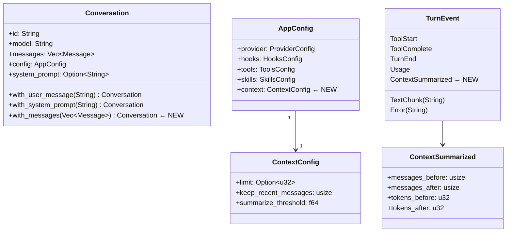

# Design — Conversation Context Management

## 1. Overview

### Problem

Long `ap` sessions accumulate hundreds of messages. When the accumulated context
approaches the provider's token limit the API call fails and the session dies
ungracefully. There is currently no visibility into context usage and no recovery
path.

### Solution

Add a lightweight, opt-in context compression pipeline that:

1. **Estimates** token usage before every turn (heuristic: `chars / 4`).
2. **Compresses** old messages into an LLM-generated summary when usage crosses
   a configurable threshold (`limit × threshold`, default 80%).
3. **Surfaces** context usage in the TUI status bar (`ctx: XX.Xk`).
4. **Exposes** `--context-limit N` CLI flag and `[context]` TOML config.

The implementation is additive: no existing behaviour changes when `limit` is
`None` (the default). All logic lives in a new `src/context.rs` module.

---

## 2. Detailed Requirements

See `requirements.md` for the numbered list. Key constraints repeated here:

- `maybe_compress_context` is a standalone `async fn`, not a middleware closure
  (because `TurnMiddlewareFn` is sync).
- `Conversation::with_messages(Vec<Message>) -> Self` consuming builder is added
  to avoid call-site `let mut` bindings.
- Every step must compile and pass `cargo test` before the next begins.

---

## 3. Architecture Overview

```mermaid
flowchart TB
    subgraph "Headless Path"
        H1[run_headless] -->|conv.with_user_message| H2[conv_with_msg]
        H2 -->|maybe_compress_context| H3{limit set?}
        H3 -->|No| H4[turn()]
        H3 -->|Yes, check estimate| H5{over threshold?}
        H5 -->|No| H4
        H5 -->|Yes| H6[summarise_messages]
        H6 --> H7[build new Conversation]
        H7 -->|emit ContextSummarized| H4
    end

    subgraph "TUI Path"
        T1[handle_submit] -->|spawn task| T2[conv.with_user_message]
        T2 -->|maybe_compress_context| T3{limit set?}
        T3 -->|No| T4[turn()]
        T3 -->|Yes| T5{over threshold?}
        T5 -->|No| T4
        T5 -->|Yes| T6[summarise_messages]
        T6 --> T7[build new Conversation]
        T7 -->|tx.send ContextSummarized| T8[handle_ui_event]
        T7 --> T4
    end

    subgraph "context.rs (pure / async)"
        E1[estimate_tokens]
        E2[find_summary_split]
        E3[summarise_messages]
        E4[maybe_compress_context] --> E1
        E4 --> E2
        E4 --> E3
    end

    subgraph "TUI State"
        T8 -->|update last_input_tokens| S1[TuiApp.last_input_tokens]
        T8 -->|push notice| S2[chat_history]
        S1 --> S3[render_status_bar: ctx: XX.Xk / YYYk ZZ%]
    end
```

---

## 4. Components and Interfaces

### 4.1 `src/context.rs` (new module)

Self-contained. No dependency on TUI. Pure functions at the bottom, async at
the top.

| Function | Pure? | Responsibility |
|---|---|---|
| `estimate_message_tokens` | Yes | Heuristic token count for one message |
| `estimate_tokens` | Yes | Sum across a slice of messages |
| `find_summary_split` | Yes | Choose split index respecting alternating-turn rule |
| `summarise_messages` | No (LLM call) | Stream a summary from the provider |
| `maybe_compress_context` | No (calls above) | Orchestrate the full compression decision |

**Split algorithm detail:**

```
split_candidate = messages.len() - keep_recent
scan messages[split_candidate..] for first Role::User
if found at position p → return Some(split_candidate + p)
else → None
```

**Summary prompt template:**

```
User: "Summarise the following conversation history concisely. Capture key
decisions, code changes, file paths modified, tool results, and any important
context needed to continue the work.\n\n{formatted}"
```

where `formatted` is each message rendered as `[Role] content\n`.

### 4.2 `src/config.rs` — `ContextConfig`

New struct with `serde(default)`. Overlaid from `[context]` TOML table in
`overlay_from_table`. Follows the identical pattern used for `[skills]`.

### 4.3 `src/types.rs` — `TurnEvent::ContextSummarized`

New `Clone` variant. Carries before/after message counts and token estimates so
both the headless stderr log and the TUI notice can be informative.

### 4.4 `src/tui/mod.rs` and `src/tui/ui.rs`

**New fields on `TuiApp`:**

| Field | Type | Purpose |
|---|---|---|
| `last_input_tokens` | `u32` | Most recent provider-reported input tokens (replaces, not accumulates) |
| `context_limit` | `Option<u32>` | From config; drives status bar percentage display |

**`handle_ui_event` additions:**

- `Usage { input_tokens, .. }` → set `self.last_input_tokens = input_tokens` (existing accumulation to `total_input_tokens` continues unchanged)
- `ContextSummarized { … }` → push `ChatEntry::AssistantDone` notice + set `self.last_input_tokens = tokens_after`

**`render_status_bar` additions:**

```
│ ctx: {last_k:.1}k                          (always)
│ ctx: {last_k:.1}k/{limit_k:.0}k ({pct:.0}%)   (when limit is Some)
```

### `TuiApp::headless_with_limit` (new test helper)

`TuiApp::headless()` has 23 existing call sites. To avoid touching them all,
**do not change `headless()`**. Instead add:

```rust
pub fn headless_with_limit(context_limit: Option<u32>) -> Self { … }
```

`headless()` remains identical to today; `headless_with_limit(None)` is
equivalent. Tests that need to exercise the context-limit code path use
`headless_with_limit(Some(N))`.

### 4.5 `src/main.rs`

**New CLI arg:** `--context-limit <N>` (optional `u32`), overrides `config.context.limit`.

**Headless wiring** (in `run_headless`):

The call site **must** clone `conv_with_msg` before passing it to
`maybe_compress_context` because the function takes ownership. The clone is kept
as the fallback for the error branch (Rust would otherwise report "use of moved
value"):

```
conv_with_msg = conv.with_user_message(prompt)
if limit set:
    fallback = conv_with_msg.clone()          // ← required — ownership is moved below
    match maybe_compress_context(conv_with_msg, ...) {
        Ok((c, evt)) => use c, log evt to stderr
        Err(e) => { log e; use fallback }     // ← fallback used here
    }
turn(conv_with_msg, ...)
```

**TUI wiring** (spawned task in `handle_submit`):

```
c = conv.clone().with_user_message(trimmed)
if limit set:
    (c, evt) = maybe_compress_context(...)
    on error → send Error event, return
    if Some(evt) → tx.send(evt)
turn(c, ...)
```

---

## 5. Data Models



---

## 6. Error Handling

| Failure mode | Location | Behaviour |
|---|---|---|
| `summarise_messages` stream error | `maybe_compress_context` | Propagated as `anyhow::Error` |
| `maybe_compress_context` error in headless | `run_headless` | Log to stderr, fall through with **pre-cloned** original conversation (see §4.5 for ownership detail) |
| `maybe_compress_context` error in TUI | spawned task | Send `TurnEvent::Error(...)`, return early (no `turn()` call) |
| No split possible (too few messages) | `maybe_compress_context` | Return `(conv, None)` — no-op |
| Estimated tokens < threshold | `maybe_compress_context` | Return `(conv, None)` — fast path no-op |

---

## 7. Testing Strategy

### Unit tests (in `src/context.rs`)

Pure functions are straightforward to test in isolation.

**Step 1 (8 tests):**
- `estimate_tokens_empty`
- `estimate_tokens_text_message`
- `estimate_tokens_tool_use`
- `estimate_tokens_tool_result`
- `find_summary_split_too_short`
- `find_summary_split_finds_user`
- `find_summary_split_skips_to_user`
- `find_summary_split_no_user_in_tail`

**Step 5 (6 async tests via `#[tokio::test]`):**
- `summarise_messages_collects_stream`
- `summarise_messages_provider_error_returns_err`
- `maybe_compress_context_no_op_under_threshold`
- `maybe_compress_context_compresses_when_over_threshold`
- `maybe_compress_context_new_messages_start_with_user`
- `maybe_compress_context_cannot_split_returns_unchanged`

### Unit tests (in `src/config.rs`)

**Step 2 (5 tests):**
- `context_config_defaults`
- `context_config_toml_limit`
- `context_config_toml_full`
- `context_config_missing_keys_preserve_defaults`
- `context_config_no_auto_summarize_when_limit_none`

### Unit tests (in `src/tui/mod.rs` and `src/tui/ui.rs`)

**Step 4 (6 tests):**
- `turn_event_context_summarized_clonable`
- `handle_ui_event_context_summarized_appends_notice`
- `handle_ui_event_usage_updates_last_input_tokens`
- `handle_ui_event_usage_still_accumulates_totals`
- `status_bar_ctx_display_no_limit`
- `status_bar_ctx_display_with_limit`

**Step 7 (1 test):**
- `tuiapp_new_stores_context_limit` — uses new `TuiApp::headless_with_limit(Some(50_000))` constructor

**Total: 26 tests** (8 + 5 + 6 + 6 + 1).

### Mock strategy

`MockProvider` and `ErrorProvider` structs (copied into `#[cfg(test)]` blocks
in `context.rs`) implement `Provider`. `MockProvider` returns a pre-configured
stream of `TurnEvent` values; `ErrorProvider` returns an error stream. This
mirrors the existing pattern in `src/turn.rs` tests.

---

## 8. Implementation Order

The 7 steps in `PROMPT.md` are the implementation order. Each is designed to
be the smallest compilable increment:

| Step | What changes | Builds on |
|---|---|---|
| 1 | `src/context.rs` pure functions | — |
| 2 | `ContextConfig` + `AppConfig.context` | Step 1 (module exists) |
| 3 | `--context-limit` CLI flag, store in local | Step 2 |
| 4 | `TurnEvent::ContextSummarized` + TUI fields/status-bar | Step 3 |
| 5 | `summarise_messages` + `maybe_compress_context` | Step 4 (event variant exists) |
| 6 | Wire headless path | Step 5 |
| 7 | Wire TUI path + `context_limit` field | Step 6 |

---

## 9. Appendices

### A. Technology choices

| Choice | Rationale |
|---|---|
| Heuristic `chars / 4` | Avoids `tiktoken` dependency; accurate enough for a threshold guard; pure and O(n) |
| Standalone `async fn` (not middleware) | `TurnMiddlewareFn` is sync; adding async support would require a breaking change to the middleware type |
| `with_messages` consuming builder | Stays consistent with existing `with_user_message` / `with_system_prompt` pattern; avoids call-site `let mut` (AGENTS.md constraint) |
| `last_input_tokens` (replace, not accumulate) | Tracks *current* context size, not historical total; the `Usage.input_tokens` field already represents the full prompt size for that turn |

### B. Alternatives considered

- **Middleware approach**: Using `TurnMiddlewareFn` for compression was rejected because it is sync. An async middleware type would require changes to `src/middleware.rs` and all callers — too invasive.
- **Cumulative token tracking**: Accumulating `input_tokens` across turns inflates the count artificially; using the most recent value correctly represents the current window occupancy.
- **`tiktoken-rs` for accurate counts**: More accurate but adds a large dependency and makes estimation async or behind a `Mutex`. The `chars / 4` heuristic is sufficient as a threshold guard.

### C. Key constraints

- Bedrock API requires alternating `User`/`Assistant` turns — the `find_summary_split` advancement to the first `User` in the tail is mandatory, not optional.
- The first message in `new_messages` is always `User` (the summary wrapper), satisfying the constraint.
- `maybe_compress_context` is best-effort: errors in headless fall through gracefully; errors in TUI surface as `TurnEvent::Error` without crashing the session.
