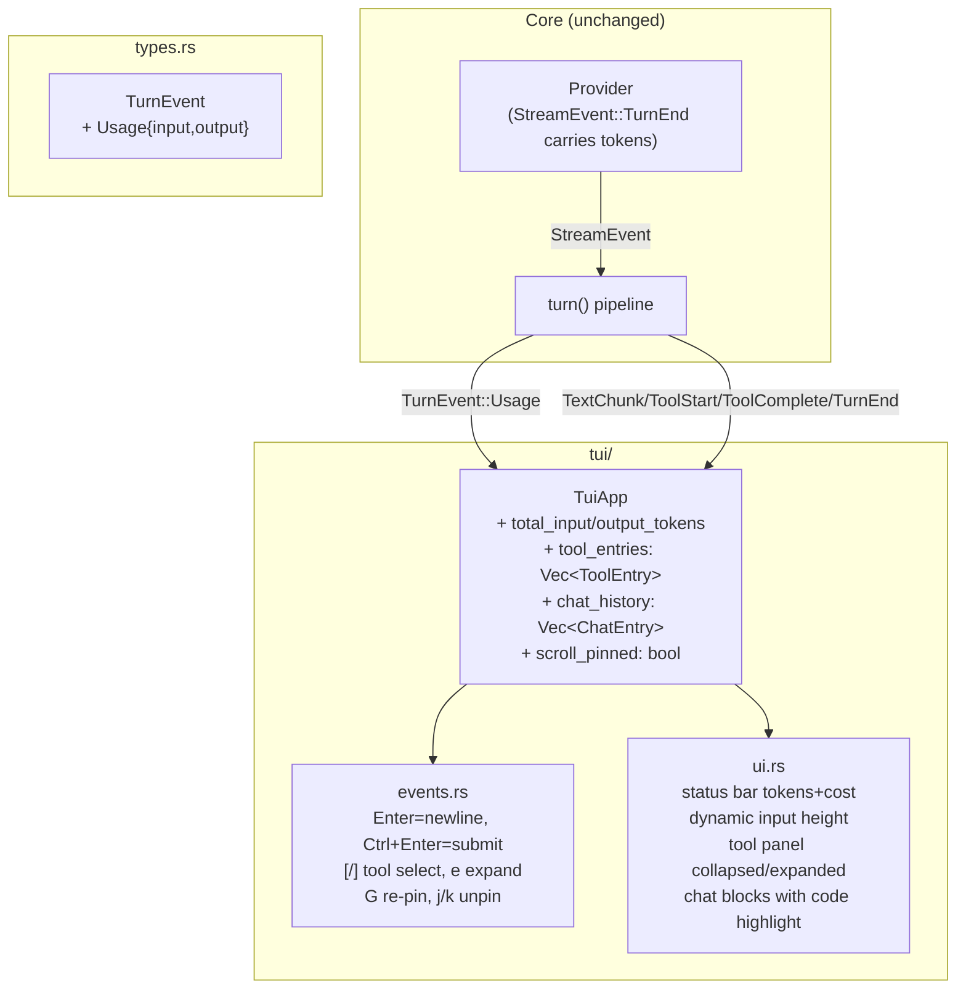

# Design — Richer TUI

## 1. Overview

`ap`'s TUI is currently functional but spartan. This design upgrades it across five independently-compilable steps: token/cost visibility, multi-line input, structured tool entries, syntax-highlighted chat history, and auto-scroll anchoring. All work is confined to `src/types.rs`, `src/turn.rs`, and `src/tui/` — no new crates required.

## 2. Architecture Overview



## 3. Data Models

```mermaid
classDiagram
    class TurnEvent {
        +TextChunk(String)
        +ToolStart{name, params}
        +ToolComplete{name, result}
        +TurnEnd
        +Error(String)
        +Usage{input_tokens u32, output_tokens u32}
    }

    class ToolEntry {
        +name: String
        +params: serde_json::Value
        +result: Option~String~
        +is_error: bool
        +expanded: bool
    }

    class ChatBlock {
        +Text(String)
        +Code{lang String, body String}
    }

    class ChatEntry {
        +User(String)
        +AssistantStreaming(String)
        +AssistantDone(Vec~ChatBlock~)
    }

    class TuiApp {
        +total_input_tokens: u32
        +total_output_tokens: u32
        +tool_entries: Vec~ToolEntry~
        +selected_tool: Option~usize~
        +chat_history: Vec~ChatEntry~
        +scroll_pinned: bool
    }

    TuiApp --> TurnEvent : handles
    TuiApp *-- ToolEntry
    TuiApp *-- ChatEntry
    ChatEntry *-- ChatBlock
```

## 4. Components and Interfaces

### 4.1 `src/types.rs` — `TurnEvent::Usage`

Add variant:
```rust
TurnEvent::Usage { input_tokens: u32, output_tokens: u32 }
```

Existing tests must still pass. New test: `turn_event_variants_are_clonable` needs the Usage variant added.

### 4.2 `src/turn.rs` — Emit Usage

Change `StreamEvent::TurnEnd { .. }` arm to:
```rust
StreamEvent::TurnEnd { input_tokens, output_tokens, .. } => {
    all_events.push(TurnEvent::Usage { input_tokens, output_tokens });
    // existing: apply_post_turn, break
}
```

The `TurnEnd` event is still emitted separately (existing logic around line 162).

### 4.3 `tui/mod.rs` — TuiApp State

**Step 1 additions:**
- `total_input_tokens: u32`, `total_output_tokens: u32` (init 0)
- Handle `TurnEvent::Usage` to accumulate

**Step 2 — no new fields** (input_buffer already exists)

**Step 3 replacements:**
- Remove `tool_events: Vec<String>`
- Add `tool_entries: Vec<ToolEntry>`, `selected_tool: Option<usize>`
- Define `ToolEntry` struct (can live in `tui/mod.rs` or separate `tui/tool_entry.rs`)

**Step 4 replacements:**
- Remove `messages: Vec<String>`
- Add `chat_history: Vec<ChatEntry>`
- Define `ChatBlock`, `ChatEntry` enums
- Implement `parse_chat_blocks(text: &str) -> Vec<ChatBlock>`
- Streaming lifecycle: TextChunk → push/append `AssistantStreaming`; TurnEnd → convert to `AssistantDone`

**Step 5 addition:**
- `scroll_pinned: bool` (init `true`)

### 4.4 `tui/events.rs` — Key Handling

**Step 2:** `Enter` → push `\n`; `Ctrl+Enter` → drain + `Action::Submit`

**Step 3:** `[`, `]`, `e` in Normal mode

**Step 5:** `j`/`PageDown` unpin; `k`/`PageUp` unpin; `G` re-pin

### 4.5 `tui/ui.rs` — Rendering

**Step 1:** Status bar: `Tokens: ↑Xk ↓Yk │ Cost: $N.NNNN`
- Format helper: `fn format_tokens(n: u32) -> String` — shows `1.2k` for ≥1000
- Cost: `(input as f64 / 1_000_000.0) * COST_PER_M_INPUT + (output as f64 / 1_000_000.0) * COST_PER_M_OUTPUT`

**Step 2:** `input_box_height(app) -> u16` function; dynamic `Constraint::Length`

**Step 3:** `render_tool_panel` rewrite — collapsed/expanded with DarkGray selection highlight

**Step 4:** `render_conversation` rewrite — `chat_history → Vec<Line>` with code block styling

## 5. Implementation Order & Test Plan

### Step 1 — tests
- `handle_ui_event_usage_accumulates`: two `Usage(50, 100)` events → totals 100+200

### Step 2 — tests
- `insert_mode_enter_adds_newline`: Enter key → `input_buffer` contains `\n`
- `insert_mode_ctrl_enter_submits`: Ctrl+Enter → `Action::Submit`, buffer cleared

### Step 3 — tests
- `tool_entry_collapsed_render`: ToolStart+ToolComplete → collapsed string
- `tool_entry_expand_toggle`: `e` key toggles `expanded`
- `tool_selection_wraps`: `]` from last entry stays at last

### Step 4 — tests
- `parse_chat_blocks_no_fence`: plain text → single Text block
- `parse_chat_blocks_single_fence`: text + code + text
- `parse_chat_blocks_with_lang`: ` ```rust ` tag extracted to `lang`
- `parse_chat_blocks_unclosed_fence`: treated as code block
- `streaming_lifecycle_ends_as_done`: TextChunk→AssistantStreaming, TurnEnd→AssistantDone
- `code_block_lines_have_dark_bg`: rendered Lines have `bg(Rgb(30,30,30))`

### Step 5 — tests
- `scroll_pinned_sets_max_on_content`: TextChunk with pinned → offset == usize::MAX
- `j_unpins`: j key → scroll_pinned false
- `G_repins`: G key → scroll_pinned true

## 6. Error Handling

- `parse_chat_blocks` is total (no fallible ops) — unclosed fences become Code blocks
- Token accumulation is integer addition — no overflow risk at realistic token counts (u32 max ≈ 4B)
- `selected_tool` out-of-bounds: always guarded with bounds check before `get_mut`

## 7. Key Constraints

- No new `Cargo.toml` dependencies
- `clippy::unwrap_used`, `expect_used`, `panic` denied outside `#[cfg(test)]`
- Each step compiled and tested before proceeding to next
- `headless()` constructor and all existing tests updated at each step

## 8. Appendices

### A. Why no separate module for ChatBlock/ToolEntry?

The types are tightly coupled to `TuiApp` state. Keeping them in `tui/mod.rs` minimises import noise. If they grow, extract to `tui/chat.rs` and `tui/tool_entry.rs`.

### B. `parse_chat_blocks` algorithm

```
state = Text, current_text = ""
for line in text.lines():
  if state == Text and line.starts_with("```"):
    push Text(current_text) if non-empty
    lang = line["```".len()..].trim()
    current_text = ""
    state = Code(lang)
  elif state == Code(lang) and line.starts_with("```"):
    push Code{lang, body: current_text}
    current_text = ""
    state = Text
  else:
    current_text += line + "\n"
if state == Text: push Text(current_text)
if state == Code(lang): push Code{lang, body: current_text}  // unclosed
```

### C. Token formatting

```
fn format_k(n: u32) -> String {
    if n >= 1000 { format!("{:.1}k", n as f64 / 1000.0) }
    else { n.to_string() }
}
```
