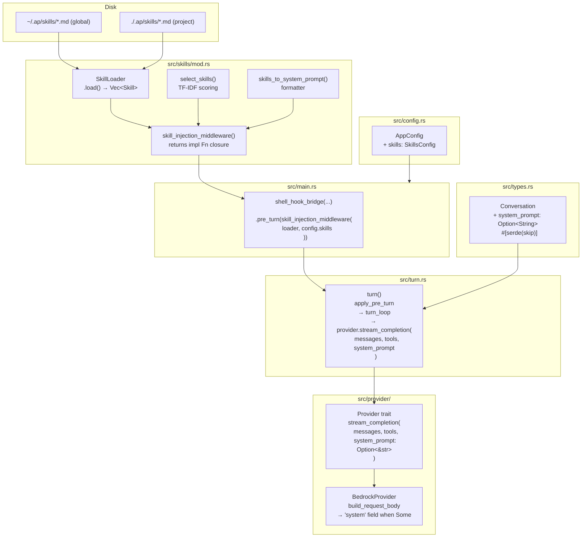
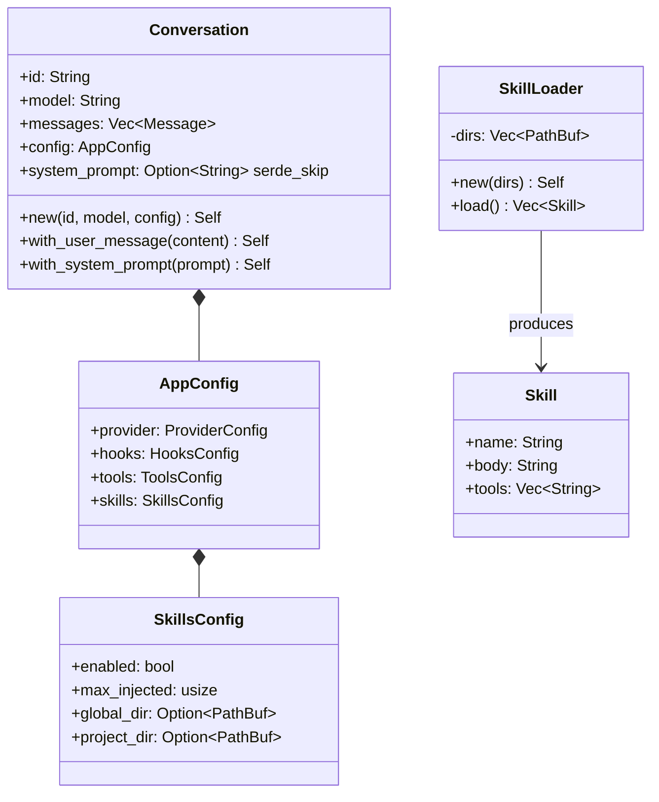

# Design: Skill System for `ap`

## 1. Overview

### Problem Statement

`ap` is a coding agent with no mechanism to inject domain-specific knowledge into LLM prompts. Users accumulate expertise in ad-hoc ways (notes, context copying) with no systematic approach to making relevant skills available at the right time.

### Solution Summary

Offline, pure-Rust skill injection using TF-IDF relevance scoring. Skill files are Markdown documents stored on disk. Before each turn, the middleware selects the most relevant skills based on the current conversation content and injects them into the system prompt — no embedding APIs, no ML dependencies, no runtime internet access required.

The implementation adds one new module (`src/skills/`), extends two existing types (`Conversation`, `AppConfig`), modifies one interface (`Provider` trait), and wires everything through the existing `Middleware::pre_turn` chain.

---

## 2. Detailed Requirements

### FR-1: `Conversation.system_prompt` — transient field
- `Conversation` gains `system_prompt: Option<String>`
- Annotated `#[serde(skip)]` — **not persisted** to session files
- Each session starts with `None`; the middleware sets it on every turn
- Builder: `Conversation::with_system_prompt(prompt: impl Into<String>) -> Self`
- **Rationale**: Skills are derived/computed content. Persisting a scored snapshot would lock in stale TF-IDF results from a prior session's messages.

### FR-2: Provider system prompt threading
- `Provider::stream_completion` gains `system_prompt: Option<&str>` parameter
- `BedrockProvider::build_request_body` accepts `system_prompt: Option<&str>`; injects `"system": text` into the JSON body when `Some`
- `turn()` reads `conv.system_prompt.as_deref()` and passes it to the provider

### FR-3: Skill files on disk
- Skills live in `~/.ap/skills/` (global) and `./.ap/skills/` (project), both optional
- Each skill is a `.md` file; filename (without extension) is the skill name
- Optional YAML-lite frontmatter at the top of the file:
  ```
  ---
  tools: [bash, read]
  ---
  ```
  Only the `tools:` key is parsed. Content below the frontmatter delimiter is the skill body.
- Project skills override global skills with the same name (later-wins)

### FR-4: `Skill` and `SkillLoader` types (`src/skills/mod.rs`)
```rust
pub struct Skill {
    pub name: String,       // filename without extension
    pub body: String,       // content below frontmatter
    pub tools: Vec<String>, // from frontmatter tools: key
}

pub struct SkillLoader {
    dirs: Vec<PathBuf>,
}

impl SkillLoader {
    pub fn new(dirs: Vec<PathBuf>) -> Self;
    pub fn load(&self) -> Vec<Skill>;  // later-wins merge by skill name
}
```

### FR-5: TF-IDF skill selection
```rust
pub fn select_skills<'a>(
    skills: &'a [Skill],
    messages: &[Message],
    max_n: usize,
) -> Vec<&'a Skill>
```
- Corpus: one document per skill (body text)
- Query: concatenated text of all conversation messages
- Returns up to `max_n` skills by descending TF-IDF score
- Skills with score 0.0 are excluded
- Tokenization: lowercase, split on non-alphanumeric characters

### FR-6: System prompt formatter
```rust
pub fn skills_to_system_prompt(skills: &[&Skill]) -> String
```
- Format:
  ```
  ## Skills

  ### skill-name
  <body>
  ```
- Callers must never pass an empty slice (the guard lives in FR-7).

### FR-7: `skill_injection_middleware()` — pre_turn closure

```rust
pub fn skill_injection_middleware(
    loader: SkillLoader,
    config: SkillsConfig,
) -> impl Fn(&Conversation) -> Option<Conversation> + Send + Sync + 'static
```

- Returns a **closure** (not a `Middleware` struct) compatible with `Middleware::pre_turn()`
- The closure:
  1. Calls `loader.load()` to get skills
  2. Calls `select_skills()` with conversation messages and `config.max_injected`
  3. **Guard**: if `select_skills` returns an empty vec, returns `None` immediately — do NOT call `skills_to_system_prompt` with an empty slice
  4. Calls `skills_to_system_prompt()` on the non-empty result
  5. **Sets** `conv.system_prompt = Some(block)` (never appends; field is always `None` on entry due to `#[serde(skip)]`)
  6. Returns `Some(mutated_conversation)`
- **Rationale**: `Middleware::pre_turn()` already accepts `impl Fn(&Conversation) -> Option<Conversation>`. Returning a closure keeps API surface minimal, avoids any `Middleware::merge` footgun, and is consistent with the builder pattern throughout the codebase.
- **No `Middleware::merge` method is needed or added.**

### FR-8: `SkillsConfig` in `AppConfig`
```rust
#[derive(Debug, Clone, Serialize, Deserialize)]
#[serde(default)]
pub struct SkillsConfig {
    pub enabled: bool,               // default: true
    pub max_injected: usize,         // default: 5
    pub global_dir: Option<PathBuf>, // default: None → resolved to ~/.ap/skills/ at wiring time
    pub project_dir: Option<PathBuf>,// default: None → resolved to ./.ap/skills/ at wiring time
}
```
- `AppConfig` gains `pub skills: SkillsConfig`
- Default dir resolution (None → platform path) happens at wiring time in `main.rs`, not in `AppConfig::load()`

### FR-9: Wiring in `main.rs`
- Both `run_headless` and `run_tui` build a `SkillLoader` from resolved config dirs
- Chain the skill closure via the existing builder:
  ```rust
  let middleware = shell_hook_bridge(&config.hooks)
      .pre_turn(skill_injection_middleware(loader, config.skills.clone()));
  ```
- If `skills.enabled == false`, skip the `.pre_turn(...)` call entirely
- **No `Middleware::merge` method is needed or added**

## Non-Functional Requirements

- **NFR-1: No new external crates** — pure Rust TF-IDF; no ML or NLP crates
- **NFR-2: Incremental compilability** — each step (1–8) compiles and passes `cargo test` before proceeding
- **NFR-3: Clippy clean** — `cargo clippy --all-targets -- -D warnings` passes throughout
- **NFR-4: Integration test** — load skills from tempdir, assert `system_prompt` contains expected skill body

---

## 3. Architecture Overview



**Data flow per turn:**
1. User input appended to `Conversation`
2. `turn()` calls `apply_pre_turn` → `skill_injection_middleware` closure fires
3. Closure loads skills, scores via TF-IDF, guards on empty result, sets `conv.system_prompt`
4. `turn_loop` calls `provider.stream_completion(messages, tools, conv.system_prompt.as_deref())`
5. `BedrockProvider` injects `"system": prompt` into the Bedrock request body when `Some`

---

## 4. Components and Interfaces

### 4.1 `src/types.rs` — `Conversation` extension

Add `system_prompt: Option<String>` with `#[serde(skip)]` and the `with_system_prompt` builder method.

**Key invariant**: `system_prompt` is always `None` when deserialized from disk. The middleware is the only writer.

### 4.2 `src/provider/mod.rs` — `Provider` trait

Change signature of `stream_completion`:
```rust
fn stream_completion<'a>(
    &'a self,
    messages: &'a [Message],
    tools: &'a [serde_json::Value],
    system_prompt: Option<&'a str>,   // NEW
) -> BoxStream<'a, Result<StreamEvent, ProviderError>>;
```

This is the most breaking change — all callers (`turn.rs`, tests) must be updated atomically in Step 2.

### 4.3 `src/provider/bedrock.rs` — `BedrockProvider`

`build_request_body` gains `system_prompt: Option<&str>`. When `Some(text)`, it inserts the Anthropic `"system"` field into the request JSON:
```json
{
  "anthropic_version": "bedrock-2023-05-31",
  "system": "<injected text>",
  "messages": [...],
  ...
}
```
When `None`, the `"system"` key is omitted.

### 4.4 `src/turn.rs` — `turn()` threading

`turn_loop` passes `conv.system_prompt.as_deref()` as the third argument to `provider.stream_completion(...)`. No other changes to `turn()` logic.

### 4.5 `src/skills/mod.rs` — New module

Five public items:

| Item | Kind | Responsibility |
|------|------|---------------|
| `Skill` | struct | Data type: name, body, tools |
| `SkillLoader` | struct | Load and merge skill files from dirs |
| `select_skills()` | fn | Pure TF-IDF selection |
| `skills_to_system_prompt()` | fn | Format selected skills as system prompt block |
| `skill_injection_middleware()` | fn | Returns pre_turn closure |

`SkillLoader::load()` algorithm:
1. For each dir in `self.dirs`, read `*.md` files
2. Parse frontmatter (if present) for `tools:` key
3. Insert into a `HashMap<String, Skill>` keyed by name (later dirs override earlier)
4. Return `HashMap::into_values().collect()`

### 4.6 TF-IDF Implementation

No external crates. Pure Rust:

```
tf(term, doc)     = count(term in doc) / len(doc)
idf(term, corpus) = ln(|corpus| / (1 + |docs containing term|))
tfidf(t, d, C)    = tf(t, d) * idf(t, C)
score(query, doc) = Σ tfidf(t, doc, corpus) for t in unique(query_terms)
```

Tokenization: `s.to_lowercase()` then `.split(|c: char| !c.is_alphanumeric())` filtering empty strings.

### 4.7 `src/config.rs` — `SkillsConfig`

New `#[serde(default)]` struct added to `config.rs`. The `overlay_from_table` (or equivalent toml merge) function must handle the `[skills]` TOML table. Default dir resolution (None → platform path) happens at wiring time in `main.rs`.

### 4.8 `src/main.rs` — Wiring

```rust
// Build dirs, filtering non-existent paths
let global_dir = config.skills.global_dir.clone()
    .unwrap_or_else(|| dirs::home_dir().unwrap().join(".ap").join("skills"));
let project_dir = config.skills.project_dir.clone()
    .unwrap_or_else(|| PathBuf::from(".ap/skills"));
let skill_dirs: Vec<PathBuf> = [global_dir, project_dir]
    .into_iter()
    .filter(|d| d.exists())
    .collect();
let loader = SkillLoader::new(skill_dirs);

// Chain onto the existing middleware builder
let middleware = if config.skills.enabled {
    shell_hook_bridge(&config.hooks)
        .pre_turn(skill_injection_middleware(loader, config.skills.clone()))
} else {
    shell_hook_bridge(&config.hooks)
};
```

This pattern applies to both `run_headless` and `run_tui`.

---

## 5. Data Models



### Frontmatter parsing

Simple line-scan parser — no YAML crate:

```
---
tools: [bash, read]
---
body text here
```

Algorithm:
1. If file starts with `---\n`, find the closing `---\n`
2. Scan lines between delimiters for `tools: [...]` pattern
3. Extract comma-separated values inside brackets, trimming whitespace
4. Everything after the closing `---\n` is the body

Files without frontmatter: entire content is the body; `tools` is empty.

---

## 6. Error Handling

| Failure Mode | Handling |
|-------------|----------|
| Skills directory does not exist | `SkillLoader::load()` skips non-existent dirs silently |
| Skill file cannot be read | `eprintln!` or `tracing::warn!`; skip the file |
| Malformed frontmatter | Treat entire file as body (graceful degradation) |
| `select_skills` returns empty | Middleware closure returns `None` — conversation unchanged, no `system_prompt` injected |
| `system_prompt` injected but provider fails | Normal provider error propagation; no special handling |

**Principle**: Skill loading is best-effort. A broken skills directory should never crash the agent or block a turn.

---

## 7. Testing Strategy

### Unit tests (inside each module)

| Test | Location | Verifies |
|------|----------|---------|
| `conversation_system_prompt_not_serialized` | `types.rs` | `#[serde(skip)]` — round-trip JSON has no `system_prompt` field |
| `conversation_with_system_prompt_builder` | `types.rs` | Builder sets field correctly |
| `provider_passes_system_prompt_to_bedrock` | `provider/bedrock.rs` | `build_request_body` with `Some(text)` includes `"system"` key |
| `provider_no_system_prompt_omits_field` | `provider/bedrock.rs` | `build_request_body` with `None` omits `"system"` key |
| `skill_loader_empty_dirs` | `skills/mod.rs` | Empty dirs → empty vec |
| `skill_loader_loads_skills` | `skills/mod.rs` | Reads files and parses body |
| `skill_loader_later_dir_overrides` | `skills/mod.rs` | Project skill overrides global skill with same name |
| `skill_frontmatter_tools_parsed` | `skills/mod.rs` | `tools: [bash, read]` extracted correctly |
| `skill_no_frontmatter_full_body` | `skills/mod.rs` | File without `---` → entire content is body |
| `select_skills_returns_top_n` | `skills/mod.rs` | TF-IDF scores computed correctly, top-N returned |
| `select_skills_excludes_zero_score` | `skills/mod.rs` | Skills with no query-term overlap excluded |
| `select_skills_empty_messages` | `skills/mod.rs` | Empty query → no skills selected |
| `skills_to_system_prompt_format` | `skills/mod.rs` | Output matches expected Markdown structure |
| `middleware_empty_skills_returns_none` | `skills/mod.rs` | When select_skills returns empty, closure returns None |
| `skills_config_default` | `config.rs` | Defaults: enabled=true, max_injected=5 |
| `skills_config_toml_overlay` | `config.rs` | TOML `[skills]` section parsed correctly |

### Integration test (`tests/skill_injection.rs`)

```
1. Create tempdir with:
   - global/: skill-a.md (body mentions "git"), skill-shared.md (global version)
   - project/: skill-b.md (body mentions "docker"), skill-shared.md (project version, different body)
2. Build SkillLoader([global, project])
3. Verify skill-shared loaded from project/ (later-wins)
4. Build Conversation with messages mentioning "git"
5. Call select_skills → assert skill-a selected, skill-b not selected
6. Run skill_injection_middleware closure → assert conv.system_prompt contains skill-a body
7. Build Conversation with no messages (empty query)
8. Run middleware → assert returns None (no injection)
```

No real LLM call needed — only the middleware layer is exercised.

---

## 8. Appendices

### A. Technology Choices

| Choice | Rationale |
|--------|-----------|
| Pure Rust TF-IDF | No external ML crates; offline; fast; auditable |
| `#[serde(skip)]` for `system_prompt` | Skills are derived content; persisting causes accumulation bugs across sessions |
| Middleware `pre_turn` chain (closure) | No new extension points needed; zero new API surface vs returning `Middleware` struct |
| Later-wins directory merge | Consistent with the existing `config.toml` overlay pattern |
| YAML-lite frontmatter (no crate) | Avoid pulling in `serde_yaml` for a single-key schema; simple line scanning suffices |

### B. Alternative Approaches Considered

| Approach | Rejected Because |
|----------|-----------------|
| Embedding-based scoring | Requires ML runtime (ONNX, PyTorch); defeats "offline pure Rust" goal |
| Hot reload (inotify) | Complexity without proportional benefit; skills reload each turn anyway |
| Separate `system_prompt` API parameter (not on `Conversation`) | Would break pure data-pipeline model; `turn()` middleware can only transform `Conversation` |
| Persist `system_prompt` with `#[serde(default)]` | Causes stale content accumulation across sessions (see Q1/A1 in idea-honing.md) |
| `skill_injection_middleware` returning `Middleware` struct | Requires new `Middleware::merge` API; invites footguns; the `pre_turn` builder already accepts the closure shape (see Q2/A2 in idea-honing.md) |

### C. Key Constraints

1. **Step 2 is the most breaking step** (Provider trait change touches every callsite). The 8-step order minimises breakage accumulation — steps 1 and 2 are done first precisely because later steps depend on them.
2. **`SkillLoader::load()` is called on every turn**, not cached. Intentional: skills files may change between turns. Performance is acceptable for expected directory sizes (tens of files).
3. **`skill_injection_middleware` returns a closure**, not a `Middleware` struct. The canonical wiring in `main.rs` is:
   ```rust
   let middleware = shell_hook_bridge(&config.hooks)
       .pre_turn(skill_injection_middleware(loader, config.skills.clone()));
   ```
   No `Middleware::merge` is needed.
4. **Empty `select_skills` result** → middleware returns `None` (no injection, conversation unchanged). The guard lives inside the closure, before calling `skills_to_system_prompt`.

### D. Resolved Decisions

| Question | Decision | Source |
|----------|----------|--------|
| `system_prompt` persistence | `#[serde(skip)]` — transient | Q1/A1 in idea-honing.md |
| Middleware set vs append | Set (replace) — field always `None` on load | Q1/A1 |
| `skill_injection_middleware` return type | `impl Fn(...)` closure, caller uses `.pre_turn(f)` | Q2/A2 in idea-honing.md |
| Empty `select_skills` result | Return `None` from closure; do not call `skills_to_system_prompt` | design.rejected FAIL-2 + Q2/A2 |
| `Middleware::merge` | NOT added — not needed | Q2/A2 |
