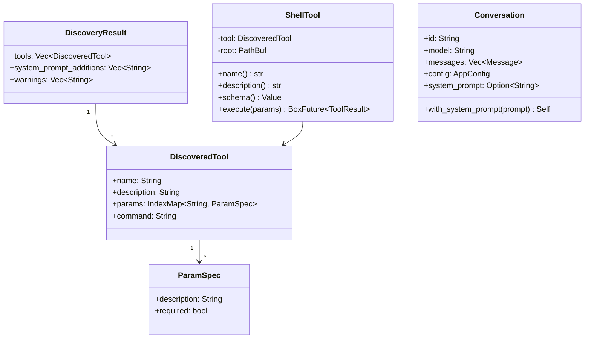

# Tool Discovery — Design Document

*Author: Ralph (Architect hat) | Date: 2026-03-22*

---

## 1. Overview

### Problem
`ap` currently gives Claude four generic built-in tools (`read`, `write`, `edit`, `bash`). Projects have specific workflows — running tests, deploying, linting — that Claude must discover through trial-and-error bash guessing. This wastes tokens, produces hallucinated commands, and gives Claude no schema to validate against.

### Solution
Tool discovery makes `ap` context-aware. At startup, `ap` reads `tools.toml` and `.ap/skills/*.toml` from the project root. Each file declares named, schematised shell tools that Claude can call directly. A project-specific system prompt is assembled from skill file `system_prompt` fields and injected into every conversation.

---

## 2. Architecture Overview

```mermaid
flowchart TB
    subgraph Startup["main.rs startup"]
        A[AppConfig::load] --> B[discover(&cwd)]
        B --> C{warnings?}
        C -- yes --> D[eprintln! warnings]
        C -- no --> E
        D --> E[Build ToolRegistry]
        E --> F[register ShellTools]
        F --> G[Build system_prompt from additions]
        G --> H[conv.with_system_prompt]
    end

    subgraph Discovery["src/discovery/mod.rs"]
        B --> I[parse tools.toml]
        B --> J[glob .ap/skills/*.toml]
        I --> K[Vec<DiscoveredTool>]
        J --> K
        J --> L[system_prompt_additions]
        K --> M[DiscoveryResult]
        L --> M
    end

    subgraph TurnPipeline["turn() pipeline"]
        H --> N[turn(conv, provider, tools, middleware)]
        N --> O[provider.stream_completion\n  messages, tools, system_prompt]
        O --> P[BedrockProvider\n  system field in API body]
    end
```

---

## 3. Components and Interfaces

### 3.1 `src/discovery/mod.rs` (new)

**Responsibility:** Pure parsing. Read files → return typed structs + warnings. No process-level I/O.

```rust
pub struct DiscoveryResult {
    pub tools: Vec<DiscoveredTool>,
    pub system_prompt_additions: Vec<String>,
    pub warnings: Vec<String>,
}

pub struct DiscoveredTool {
    pub name: String,
    pub description: String,
    pub params: IndexMap<String, ParamSpec>,
    pub command: String,
}

pub struct ParamSpec {
    pub description: String,
    #[serde(default = "default_required")]
    pub required: bool,
}

fn default_required() -> bool { true }

pub fn discover(root: &Path) -> DiscoveryResult;
```

**Key design decisions:**
- Infallible: returns `DiscoveryResult` (never panics, never returns `Result`)
- Warnings accumulate: one bad file doesn't abort discovery
- Uses TOML intermediate structs (`ToolsFile`, `SkillFile`) with serde for clean separation between parse layer and domain layer
- **Skip-whole-file on parse error:** serde deserializes `Vec<RawTool>` all-or-nothing; any bad `[[tool]]` entry fails the entire file → one warning, move on. No custom deserialization needed.
- **Warn-and-skip-duplicate for name collisions:** `discover()` tracks seen names in a `HashSet<String>`. Load order: `tools.toml` first (highest precedence), then `.ap/skills/*.toml` alphabetically. A tool whose name was already seen gets a warning and is skipped. `ToolRegistry` is never passed duplicates.

**TOML intermediate types** (private):
```rust
#[derive(Deserialize)]
struct ToolsFile { #[serde(rename = "tool", default)] tools: Vec<RawTool> }

#[derive(Deserialize)]
struct SkillFile {
    system_prompt: Option<String>,
    #[serde(rename = "tool", default)]
    tools: Vec<RawTool>,
}

#[derive(Deserialize)]
struct RawTool {
    name: String,
    description: String,
    command: String,
    #[serde(default)]
    params: IndexMap<String, ParamSpec>,
}
```

**Collision detection inside `discover()`:**
```rust
let mut seen: HashSet<String> = HashSet::new();
// For each RawTool from each file, in load order:
if seen.contains(&raw.name) {
    warnings.push(format!("tool '{}' in {} conflicts with earlier definition — skipped", raw.name, filename));
    continue;
}
seen.insert(raw.name.clone());
tools.push(raw.into()); // convert RawTool → DiscoveredTool
```

### 3.2 `src/tools/shell.rs` (new)

**Responsibility:** Bridge between a `DiscoveredTool` and the `Tool` trait. Executes via `sh -c`, injecting `AP_PARAM_*` env vars.

```rust
pub struct ShellTool {
    tool: DiscoveredTool,
    root: PathBuf,
}
```

**Execution contract:**
1. For each `required: true` param missing from `params` JSON → return `ToolResult::err("missing required parameter: {key}")`
2. For each supplied param → `env.insert("AP_PARAM_{KEY_UPPERCASE}", value.to_string())`
3. Run `sh -c {command}` with env, working directory = `root`
4. Return `ToolResult::ok("{stdout}\n{stderr}\nexit: {code}")` (same format as `BashTool`)

**Schema generation:**
```json
{
  "name": "{tool.name}",
  "description": "{tool.description}",
  "input_schema": {
    "type": "object",
    "properties": {
      "{param_key}": {
        "type": "string",
        "description": "{param.description}"
      }
    },
    "required": ["{required_param_keys...}"]
  }
}
```

### 3.3 `src/types.rs` (modified)

Add `system_prompt` field to `Conversation`:
```rust
pub struct Conversation {
    pub id: String,
    pub model: String,
    pub messages: Vec<Message>,
    #[serde(default)]
    pub config: AppConfig,
    #[serde(default)]
    pub system_prompt: Option<String>,  // NEW
}
```

Add builder:
```rust
pub fn with_system_prompt(mut self, prompt: impl Into<String>) -> Self {
    self.system_prompt = Some(prompt.into());
    self
}
```

### 3.4 `src/provider/mod.rs` (modified)

Updated `Provider` trait:
```rust
pub trait Provider: Send + Sync {
    fn stream_completion<'a>(
        &'a self,
        messages: &'a [Message],
        tools: &'a [serde_json::Value],
        system_prompt: Option<&'a str>,  // NEW
    ) -> BoxStream<'a, Result<StreamEvent, ProviderError>>;
}
```

### 3.5 `src/provider/bedrock.rs` (modified)

`build_request_body` gains `system_prompt: Option<&str>`:
```rust
fn build_request_body(
    messages: &[Message],
    tools: &[serde_json::Value],
    system_prompt: Option<&str>,
) -> serde_json::Value {
    let mut body = json!({
        "anthropic_version": "bedrock-2023-05-31",
        "max_tokens": 8192,
        "messages": Self::build_messages(messages),
    });
    if let Some(sp) = system_prompt {
        body["system"] = json!(sp);
    }
    if !tools.is_empty() {
        body["tools"] = serde_json::Value::Array(tools.to_vec());
    }
    body
}
```

### 3.6 `src/turn.rs` (modified)

`turn_loop` extracts system prompt and passes to provider:
```rust
let system_prompt = conv.system_prompt.as_deref();
let mut stream = provider.stream_completion(&messages_snapshot, &tool_schemas, system_prompt);
```

### 3.7 `src/main.rs` (modified)

Startup wiring (both `run_headless` and `run_tui`):
```rust
let project_root = std::env::current_dir().unwrap_or_default();
let discovery = discover(&project_root);
for w in &discovery.warnings {
    eprintln!("ap: {w}");
}

let mut tools = ToolRegistry::with_defaults();
for discovered in discovery.tools {
    tools.register(Box::new(ShellTool::new(discovered, project_root.clone())));
}

let system_prompt: Option<String> = if discovery.system_prompt_additions.is_empty() {
    None
} else {
    Some(discovery.system_prompt_additions.join("\n\n"))
};

let conv = Conversation::new(...);
let conv = match system_prompt {
    Some(sp) => conv.with_system_prompt(sp),
    None => conv,
};
```

---

## 4. Data Models



---

## 5. Error Handling

| Failure Mode | Strategy | Result |
|---|---|---|
| `tools.toml` not found | Skip silently, no warning | `DiscoveryResult` with empty tools from this file |
| `tools.toml` malformed TOML or bad field | Warning + **skip entire file** | Warning: `"tools.toml: {parse_error}"` |
| `.ap/skills/x.toml` malformed TOML or bad field | Warning + **skip entire file** | Warning: `".ap/skills/x.toml: {parse_error}"` |
| Tool name already seen (duplicate across files) | Warning + skip later definition | Warning: `"tool '{name}' in {file} conflicts with earlier definition — skipped"` |
| Missing required param at execution | Immediate error | `ToolResult::err("missing required parameter: {key}")` |
| Command execution failure (spawn error) | Error | `ToolResult::err("failed to spawn command: {e}")` |
| Non-zero exit code | NOT an error | `ToolResult::ok(...)` with `exit: {code}` in content |
| `current_dir()` fails at startup | Use `.` as fallback | `unwrap_or_else(|_| PathBuf::from("."))` |

**Skip-whole-file rationale:** serde deserializes `Vec<RawTool>` all-or-nothing. Any malformed `[[tool]]` entry causes the entire file parse to fail. Implementing per-tool recovery would require a custom two-phase deserializer (~15 extra lines) with no meaningful benefit — the user must fix the file regardless. Simple serde gives Path A (skip file) for free.

**Deduplication order:** `tools.toml` → `.ap/skills/*.toml` (alphabetical). First definition wins. Subsequent definitions of the same name are warned and skipped by a `HashSet<String>` maintained inside `discover()`. `ToolRegistry` receives a pre-deduplicated list.

---

## 6. Testing Strategy

### Unit Tests (`src/discovery/mod.rs`)
- `discover()` with empty temp dir → empty `DiscoveryResult`
- `discover()` with valid `tools.toml` → correct `DiscoveredTool` count + fields
- `discover()` with malformed `tools.toml` → warning in result, no tools from that file, no panic
- `discover()` with one valid `[[tool]]` and one malformed `[[tool]]` in same file → **whole file skipped**, one warning
- `discover()` with `.ap/skills/` containing valid + invalid files → partial success + warnings
- `discover()` with `system_prompt` in skill file → appears in `system_prompt_additions`
- `discover()` with `required = false` param → included in tools but not in `required` array
- `discover()` with duplicate tool name across `tools.toml` and a skill file → first definition kept, second skipped with warning, `DiscoveryResult.tools` has no duplicates

### Unit Tests (`src/tools/shell.rs`)
- Schema generation: required params in `"required"` array, optional params not
- Execute with all required params: env vars set, command runs
- Execute with missing required param: returns `ToolResult::err`
- Execute with optional param missing: command runs without that env var
- Execute with command that uses `$AP_PARAM_FOO`: env var correctly substituted

### Integration
- `Provider::stream_completion` mock updated to accept `system_prompt` param
- Bedrock `build_request_body` test: `system_prompt Some` → `"system"` in body; `None` → no `"system"` key

### Regression
All existing tests must pass unchanged after Step 4 (signature changes propagate through tests automatically — the compiler enforces this).

---

## 7. Implementation Order (5 Steps)

Each step must leave `cargo check` passing.

| Step | Files Changed | Notes |
|---|---|---|
| 1 | `src/discovery/mod.rs` (new), `Cargo.toml` | Add `indexmap` dep; pure types + serde; no I/O yet |
| 2 | `src/discovery/mod.rs` | Add `discover()` fn; `tempfile` tests |
| 3 | `src/tools/shell.rs` (new), `src/tools/mod.rs` | Add `ShellTool`; export from tools module |
| 4 | `src/types.rs`, `src/provider/mod.rs`, `src/provider/bedrock.rs`, `src/turn.rs` | System prompt threading; updates existing signatures + all call sites |
| 5 | `src/main.rs` | Wire discovery + ShellTools at startup |

---

## 8. Appendices

### A. Technology Choices

| Choice | Rationale |
|---|---|
| `indexmap::IndexMap` | Preserves TOML insertion order for params; better UX than alphabetical BTreeMap |
| `sh -c` for command execution | Consistent with BashTool; supports shell expansion, pipes, redirects |
| `AP_PARAM_*` prefix | Unambiguous namespace; clearly identifies tool-injected vars |
| Infallible `discover()` | Matches `AppConfig::load().unwrap_or_default()` pattern throughout main.rs |
| `warnings: Vec<String>` in result | Caller decides how/whether to surface warnings; discovery is never fatal |

### B. Alternative Approaches Considered

**`discover()` returns `Result`** — Rejected. One bad file aborts all discovery. Too harsh for an additive, best-effort feature. See idea-honing.md Q1.

**`ParamType` enum** — Rejected. Env vars are always strings at OS level. Added complexity buys nothing at execution time. Deferred until there's a concrete need.

**`BTreeMap` instead of `IndexMap`** — Rejected. Alphabetical ordering of params in Claude's schema diverges from author intent. `IndexMap` preserves the semantic ordering the tool author chose.

**Single global `tools.toml` only** — Rejected. `.ap/skills/*.toml` enables per-project skill packs that can be shared as git submodules or dotfile repos.

### C. Key Constraints

- `ShellTool` runs commands as the current user with no sandboxing — same trust model as `BashTool`
- `tempfile` is a dev-dependency; `discover()` uses `std::fs` for production I/O
- `indexmap` must be added to production dependencies (not dev-only)
- The `Conversation` `system_prompt` field must have `#[serde(default)]` to avoid breaking existing session files that don't have this field
